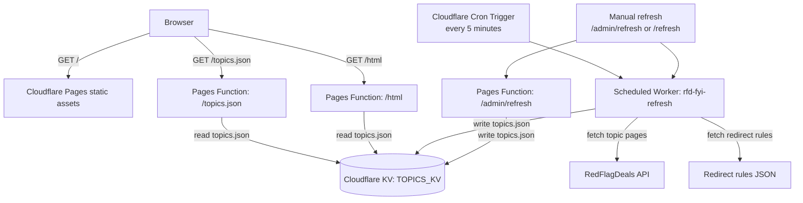

# rfd-fyi

This repository provides a simple, less-distracting overlay for hot deals posted on https://forums.redflagdeals.com.

The frontend is made with Vue 3. Cloudflare Pages serves the frontend and Pages Functions serve `/topics.json` and `/html` from Cloudflare KV. A scheduled Cloudflare Worker refreshes the cached topics to avoid excessive requests to RedFlagDeals itself.

## Architecture



## Cloudflare deployment

Install dependencies and log in to Cloudflare:

```sh
npm install
npx wrangler login
```

Create a KV namespace and a preview namespace:

```sh
npx wrangler kv namespace create TOPICS_KV
npx wrangler kv namespace create TOPICS_KV --preview
```

Copy the returned namespace IDs into both:

- `wrangler.toml`
- `worker/wrangler.toml`

Deploy the Pages app:

```sh
npm run pages:deploy
# or
just deploy-pages
```

Deploy the scheduled refresh Worker:

```sh
npm run worker:deploy
# or
just deploy-worker
```

Deploy both:

```sh
just deploy
```

The Worker runs every 5 minutes and writes the latest topics to KV. Pages reads that cached JSON at `/topics.json` and renders a no-JavaScript view at `/html`.

Optional manual refresh endpoints:

```sh
# For the Pages /admin/refresh endpoint
npx wrangler pages secret put REFRESH_SECRET --project-name rfd-fyi
curl -X POST -H "Authorization: Bearer $REFRESH_SECRET" https://<your-pages-domain>/admin/refresh

# For the Worker /refresh endpoint
npx wrangler secret put REFRESH_SECRET --config worker/wrangler.toml
curl -H "Authorization: Bearer $REFRESH_SECRET" https://rfd-fyi-refresh.<your-subdomain>.workers.dev/refresh
```

## Local Development

### Full Cloudflare Pages local dev

Run the Cloudflare Pages build locally, including Pages Functions:

```sh
npm run pages:dev
```

Wrangler serves the app at:

```text
http://localhost:8788
```

Local Pages KV starts empty, so the app may initially show no deals. Seed local KV by calling the manual refresh endpoint in another shell:

```sh
curl -X POST -H "Authorization: Bearer dev" http://localhost:8788/admin/refresh
```

A successful refresh returns something like:

```json
{"refreshed":191}
```

After that, these local endpoints should return populated data:

```text
http://localhost:8788/topics.json
http://localhost:8788/html
```

### Refresh Worker local dev

To run the scheduled refresh Worker locally:

```sh
npm run worker:dev
```

### Frontend-only Vite dev

For frontend-only Vite development:

```sh
npm run serve
```

The Vite dev server proxies `/topics.json` and `/html` to `https://rfd-fyi.pages.dev` by default, so it should show live deals without seeding local KV. Override with `VITE_API_ORIGIN` if needed:

```sh
VITE_API_ORIGIN=http://localhost:8788 npm run serve
```
